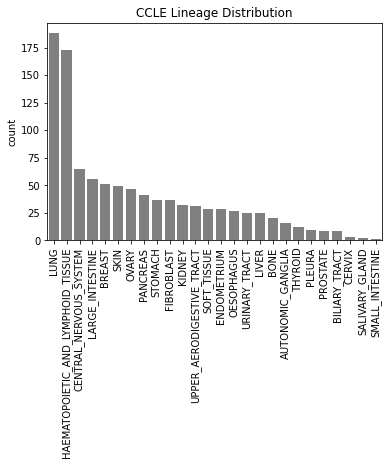
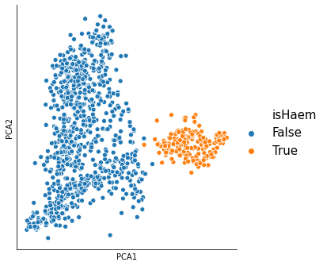
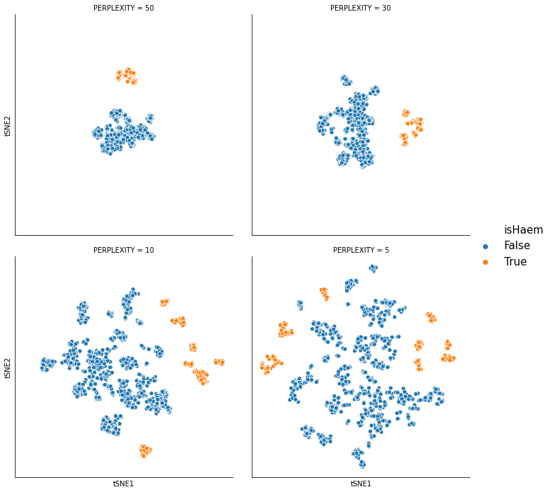
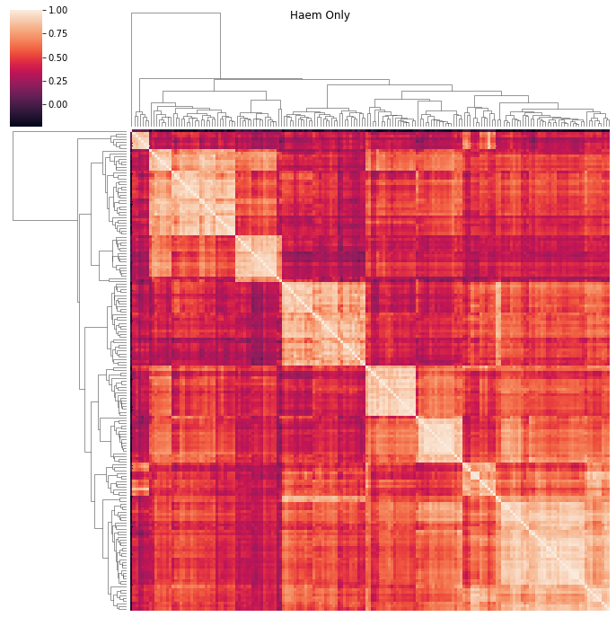
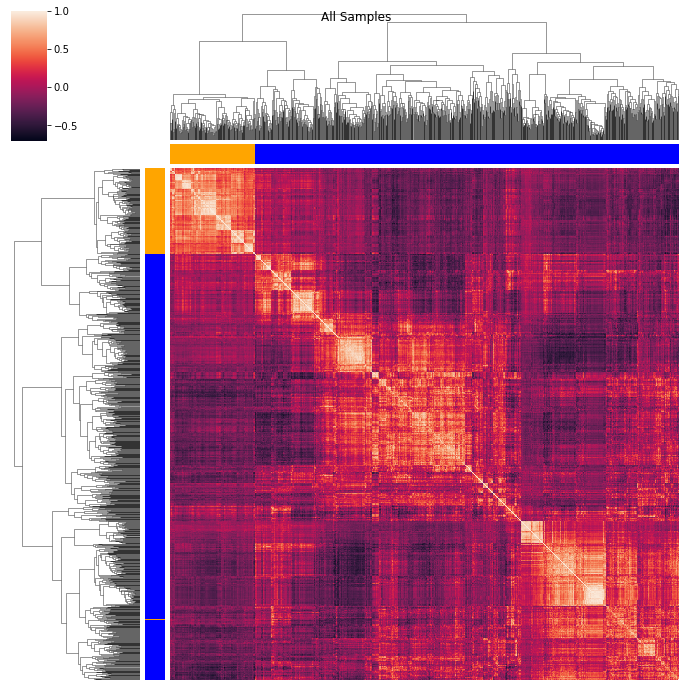

tSNE has become an invaluable tool for unsupervised data exploration. This post explores the application of tSNE to a biological dataset. Our goal will be to understand how the behavior of tSNE on this dataset relates to the math underlying the tSNE algorithm.

The dataset we will use is RNA-Seq data from the Cancer Cell Line Encyclopedia ([CCLE](https://portals.broadinstitute.org/ccle)). In particular we have 1019 cell lines and 57,820 genes which have been annotated to be derived from 26 lineages. (If you are unfamiliar with this type of biological data, a cell line is a sample, a gene is a feature and a lineage is a class of samples which we have belief to be similar to each other. In the context of MNIST: cell line ~ image, gene ~ pixel and lineage ~ digit.)

## PCA and tSNE
In this post we will specfically focus on a single lineage, HAEMATAPOETIC\_AND\_LYMPHOID\_TISSUE (Haem from here on), with 173 samples. Below is the scatter plot of the data projected onto the first two principal components of the dataset:

We can see from the PCA projection that the Haem samples are separate from the rest of the samples in terms of their gene expression profiles. Lets see what it looks like with tSNE (we run tSNE with default parameters and 4 different values of perplexity).

As perplexity decreases from 50 to 5, there are two major differences we observe in the tSNE projections: 

* At a perplexity of 50 the points appear to be in two major groups whereas at a perplexity of 5 there are many more groups.[^group]
* At a perplexity of 50 the Haem points are all in one group in one part of the plot, whereas at a perplexity of 5 they are in multiple groups spread throughout the plot. 

## The math behind tSNE
What is driving this behavior? Lets take a closer at the math behind how the perplexity parameter is used in tSNE.

We first set up the general tSNE optimization problem. tSNE is a method for mapping high dimensional data points into a low dimensional points. Let $X = \{x_1, ... x_n\}$ denote the high dimensional points and $Y = \{y_1, ... y_n\}$ the corresponding low dimensional points (which is what we want to determine). This is implemented as minimizing the KL divergence between the high-dimensional and low dimensional similarites [^secretsauce] [^psim]:

$$ 
\min_Y KL(P||Q) 
$$

where 

$$
P_{ij} \sim e^{\frac{-||x_i - x_j||^2}{2\sigma_i^2}}
$$

$$
Q_{ij} \sim \frac{1}{1 + ||y_i - y_j||^2}
$$

Algorithmically tSNE starts by first calculating $P$ and then using gradient descent to find $Y$ such that $KL(P||Q)$ is minimized. 

So where does perplexity come in? Perplexity is related to $\sigma_i$ - so lets first understand the role of $\sigma_i$. $\sigma_i$ controls the decay rate of the exponential which measures the similarity between $x_i$ and $x_j$. If $\sigma_i$ is small, then $x_i$ and $x_j$ have to be relatively close in order for them to be considered similar ($P_{ij}$ is large). Conversely, if $\sigma_i$ is large, then they may be further apart in order to achieve the same similarity. 

It's important to note that tSNE sets a separate $\sigma_i$ for each data point (hence the $i$ index). This is because the high-dimensional dataset may have areas of varying density. In a high-density part of the space, a lower $\sigma_i$ is more likely to be appropriate, but in a lower density part of the space a higher $\sigma_i$ may be appropriate.

The perplexity is a global parameter that determines how each $\sigma_i$ is chosen. tSNE sets $\sigma_i$ such that, for each $i$

$$
\text{Perplexity} = 2^{H(P_i)}
$$

where $P_i$ is the vector of similarities between $x_i$ and all other datapoints, and $H(P_i)$ is the Shannon entropy of $P_i$

$$
H(P_i) = - \sum_j p_{ij} \log_2 p_{ij}
$$

Note that the Shannon entropy of a discrete random variable uniformly distributed on $k$ outcomes is $\log_2 k$. Thus, heuristically, $\sigma_i$ is chosen such that $x_i$ is similar to $k$ other data points, where $k$ is the Perplexity passed into tSNE. 

## Understanding tSNE behavior on CCLE
Now lets relate this back to the CCLE dataset. From the PCA projection we know that the Haem samples are more similar to each other than to non-Haem samples. Given that there are only 173 Haem samples, at a perplexity of 50 (which roughly means that each sample is similar to 50 other samples), tSNE basically thinks that all the Haem samples are just one big group. This is why they all appear together in the tSNE projection. But, at a perplexity of 5, tSNE realizes there are subsets of the Haem samples which are more similar to each other, which is why the Haem group is broken up into subgroups.

Okay, so why do the Haem subgroups appear in different regions of the tSNE projection? Let's take a closer look at the KL divergence formula

$$
KL(P||Q) = \sum_{ij} P_{ij} \log \left( \frac{P_{ij}}{Q_{ij}} \right)
$$

and note that [^lhopital]

$$
\lim_{P_{ij} \to 0} P_{ij} \log \left( \frac{P_{ij}}{Q_{ij}} \right) = 0
$$

If $P_{ij}$ is small, then the $ij$ term in the $KL$ objective will be small *regardless* of $Q_{ij}$. So, at low perplexity, the subgroups of the Haem samples are not similar to each other, and as such they do not need to appear close together in the tSNE projection.

## Final thoughts

It's important to keep in mind that tSNE is only one tool in the data exploration toolbox. Whenever you think you've found something interesting in a tSNE plot, its a good idea to make sure this is real structure and not an artifact of the tSNE procedure (see [this post](https://distill.pub/2016/misread-tsne/) for some examples, especially example 1 which examines perplexity). In this case we can also visualize this data with a clustergram. 

<!--
-->

 

We see that indeed there is structure within the dataset and substructure within the Haem samples. This makes sense with what we know about these cell lines: the Haem lineage is itself made of many different sublineages of the Haematopoetic lineage (eg lymphoma, leukemia, myeloma etc). 

[^secretsauce]: The 'secret sauce' of tSNE is encoded in two observerations about this optimization problem: 1) $KL$ divergence is not symmetric. 2) $P$ employs a gaussian kernal to compute similarities whereas $Q$ employs a t-distributed kernel. This could be the subject of another post.

[^psim]: The actual tSNE implementation of $P$ is slightly different than what I've stated here. See equation (1) and discussion after equation (3) in [tsne publication) for details. This is an important nuance which I've ignored for the sake of clarity and exposition. I've also omitted the normalizations that should appear in the denominator for both $P$ and $Q$.

[^group]: I am intentionally not using the word 'cluster' since this word is overloaded. By group I simply mean a set of points that appears (by eye) to be separate from the rest of the points.

[^lhopital]: This follows from $\lim_{x \to 0} x \log(x) = 0$ (which can be computed using L'hopitals rule) and noting that $Q_{ij}$ is large relative to $P_{ij}$ (given the differences in similarity kernels)